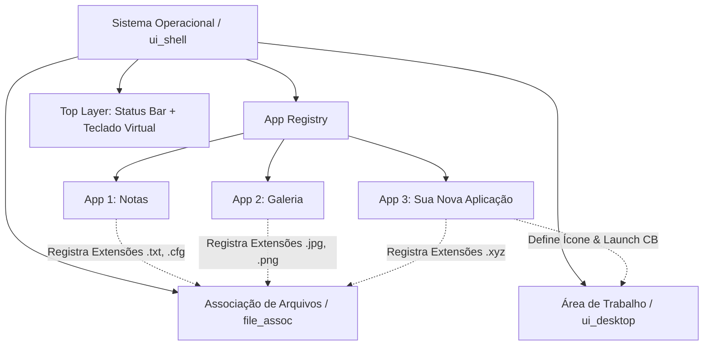

# Guia de Desenvolvimento de Aplicações para o Tab5 OS

Este documento serve como referência técnica oficial e guia prático para desenvolvedores criarem, registrarem e integrarem novas aplicações no **Tab5 OS** (M5Stack Tab5 / ESP32-P4).

---

## 1. Visão Geral da Arquitetura

O **Tab5 OS** utiliza um modelo modular e descentralizado de Sistema Operacional baseado em **LVGL 9** e **ESP-IDF**.



### Princípios de Design:
- **Descentralização**: Cada aplicativo é dono do seu ciclo de vida, seus recursos de tela, seu ícone no desktop e dos tipos de arquivo que sabe abrir.
- **Isolamento de Camadas**: A barra de status do SO e o teclado virtual residem no `lv_layer_top()`, independentes das telas de aplicação.
- **Consistência Visual**: Todas as aplicações utilizam a barra de título unificada (`ui_app_bar_t`), paletas de tema dinâmicas (`ui_theme`) e tipografia padronizada (`ui_font`).

---

## 2. Requisitos Obrigatórios de uma Aplicação

Para que uma nova aplicação seja reconhecida e funcione corretamente no sistema, ela deve implementar as seguintes funções e estruturas:

| Função / Elemento | Tipo | Descrição |
| :--- | :--- | :--- |
| `ui_<app>_register(void)` | **Obrigatório** | Cria e registra o manifesto `app_desc_t` no `app_registry`. |
| `ui_<app>_create(void)` | **Obrigatório** | Cria e retorna o objeto da tela (`lv_obj_t*`) com sua interface LVGL. |
| `ui_<app>_refresh_theme(void)` | **Obrigatório** | Reaplica as cores do tema ativo (claro/escuro) aos elementos da tela. |
| `ui_<app>_apply_layout(void)` | **Obrigatório** | Reajusta dimensões e posições após rotação ou abertura/fechamento do teclado virtual. |
| `ui_<app>_on_open(void)` | *Opcional* | Callback executado ao abrir a tela (iniciar tarefas, timers ou streaming). |
| `ui_<app>_on_close(void)` | *Opcional* | Callback executado ao fechar a tela (pausar tarefas, liberar buffers ou hardware). |
| `ui_<app>_open_file(path)` | *Opcional* | Callback executado quando o app é acionado para abrir um arquivo específico. |

---

## 3. Registro da Aplicação (`app_desc_t`)

O manifesto da aplicação é declarado através da estrutura `app_desc_t` definida em [`app_registry.h`](file:///home/moises/Projetos/tab5-os/components/os/core/app_registry.h):

```cpp
typedef struct {
    const char *id;                         /**< ID único em minúsculas (ex: "calc", "player") */
    const char *name;                       /**< Nome exibido na área de trabalho (ex: "Calculadora") */
    const char *icon_symbol;                /**< Símbolo LVGL ou texto curto (ex: LV_SYMBOL_EDIT, ">_") */
    app_icon_builder_cb_t icon_builder;     /**< Callback para desenho customizado do ícone (opcional) */
    app_icon_theme_cb_t icon_theme_refresh; /**< Callback para atualizar tema de ícone customizado (opcional) */
    app_launch_cb_t on_launch;              /**< Callback para abrir o app pelo desktop */
    const char *const *file_extensions;     /**< Lista de extensões suportadas terminada em NULL */
    app_open_file_cb_t on_open_file;        /**< Callback para abrir arquivos suportados */
} app_desc_t;
```

---

## 4. Componentes Compartilhados do Sistema

### 4.1. Barra de Título Padronizada (`ui_app_bar_t`)

Localizada em [`ui_app_bar.h`](file:///home/moises/Projetos/tab5-os/components/os/shell/ui_app_bar.h), padroniza o cabeçalho de todas as aplicações com:
- Título da aplicação alinhado à esquerda.
- Botão "Fechar" à direita (estilo quadrado/retangular compacto 36×28px com raio 6px).
- Suporte a botões de ação personalizados.

#### API Principal:
```cpp
/* 1. Cria a barra no topo da tela */
ui_app_bar_t app_bar = ui_app_bar_create(parent_screen, "Nome do App", on_close_cb, user_data);

/* 2. Adiciona botões de ação personalizados (ficam à esquerda do botão fechar) */
lv_obj_t *btn_salvar = ui_app_bar_add_action_button(&app_bar, LV_SYMBOL_SAVE, on_save_cb, nullptr, &lbl_salvar);

/* 3. Atualiza o título dinamicamente (ex: nome do arquivo aberto) */
ui_app_bar_set_title(&app_bar, "Notas - nota.txt");

/* 4. Atualiza o tema da barra */
ui_app_bar_refresh_theme(&app_bar);
```

> [!IMPORTANT]
> **Padrão de Nomenclatura de Títulos:**
> - Sempre mantenha o nome da aplicação visível no título em texto puro (sem símbolos gráficos embutidos no título).
> - Ao exibir contexto adicional (ex: pasta atual ou arquivo em edição), use o separador `" - "`:
>   - Exemplo 1: `"Arquivos - /sdcard/fotos"`
>   - Exemplo 2: `"Notas - Sem título"` ou `"Notas - config.txt"`
>   - Exemplo 3: `"Galeria - foto.jpg (1/10)"`

---

### 4.2. Sistema de Temas (`ui_theme`)

Localizado em [`ui_theme.h`](file:///home/moises/Projetos/tab5-os/components/os/shell/ui_theme.h), gerencia as paletas Claro / Escuro do sistema.

#### Cores Disponíveis na Paleta (`ui_palette_t`):
- `background`: Fundo principal da aplicação.
- `surface`: Superfície de cards, caixas e botões (ex: `#1A2130` escuro / `#FFFFFF` claro).
- `surface_alt`: Superfície secundária e barras de cabeçalho (`#202A3D` / `#E9EDF4`).
- `border`: Borda sutil de componentes (`#2A3450` / `#D7DCE5`).
- `accent`: Cor de destaque e foco (Azul `#3B82F6`).
- `accent_soft`: Fundo suave de destaque e seleção (`#263E68` / `#D6E4FB`).
- `text`: Cor principal de texto e ícones (`#E7ECF5` / `#1F2430`).
- `text_muted`: Cor secundária de texto atenuado (`#8491A8` / `#6B7385`).

#### Uso:
```cpp
const ui_palette_t *pal = ui_theme_get();
lv_obj_set_style_bg_color(meu_container, lv_color_hex(pal->surface), 0);
lv_obj_set_style_text_color(meu_label, lv_color_hex(pal->text), 0);
```

---

### 4.3. Tipografia e Fontes (`ui_font`)

Localizado em [`ui_font.h`](file:///home/moises/Projetos/tab5-os/components/os/shell/ui_font.h):
- `lv_font_montserrat_14_latin1`: Fonte padrão do sistema configurada globalmente no tema do display (`lv_theme_default_init`). Possui suporte completo ao range Latin-1 (`0x20-0x7F`, `0xA0-0xFF`: á, é, í, ó, ú, ç, ã, õ, etc.) + símbolos do LVGL.
- `lv_font_montserrat_28_latin1`: Fonte grande para ícones do desktop, contadores e cabeçalhos de destaque.
- `lv_font_montserrat_56_latin1`: Fonte extra grande usada no relógio do protetor de tela. Gerada com o mesmo comando/cobertura da de 28px (`--size 56` via `lv_font_conv`).

> [!TIP]
> **Herança e Ortografia PT-BR:**
> - Como `lv_font_montserrat_14_latin1` é a fonte padrão do tema do sistema operacional, qualquer widget criado herda nativamente a capacidade de renderizar caracteres acentuados sem gerar caracteres desconhecidos (tofu `[]`).
> - **Regra de Ortografia:** Sempre escreva textos da interface com a acentuação e pontuação corretas em português (ex: `"Gravação"`, `"Configurações"`, `"Áudio"`, `"Exclusão"`, `"Nenhum áudio em reprodução"`).

---

### 4.4. Teclado Virtual Integrado (`ui_keyboard`)

Localizado em [`ui_keyboard.h`](file:///home/moises/Projetos/tab5-os/components/os/shell/ui_keyboard.h):
- Ao focar um `lv_textarea`, o teclado virtual pode ser aberto com `ui_keyboard_show(textarea)`.
- Ao fechar a aplicação ou desfocar o campo, use `ui_keyboard_hide()`.
- Consulte a altura ocupada pelo teclado com `ui_keyboard_get_height()` para redimensionar a área útil da aplicação de forma reativa.

---

### 4.5. Sistema de Arquivos e Armazenamento

- **Cartão SD**: Montado em `/sdcard/` (FATFS de alto desempenho via SDIO de 4 vias).
- **Diretório Padrão de Configurações**: `/sdcard/tab5_os/` (ex: `wifi.cfg`, `bt.cfg`, `ai.cfg`).
- **NVS (Non-Volatile Storage)**: Para preferências do sistema (brilho, timeout de protetor de tela, rotação).

---

## 5. Passo a Passo para Adicionar uma Nova Aplicação

### Passo 1: Criar a Pasta do App e o Header [`components/apps/meuapp/ui_meuapp.h`](file:///home/moises/Projetos/tab5-os/components/apps/meuapp/ui_meuapp.h)

```cpp
#pragma once

#include "lvgl.h"

#ifdef __cplusplus
extern "C" {
#endif

void ui_meuapp_register(void);
lv_obj_t *ui_meuapp_create(void);
void ui_meuapp_refresh_theme(void);
void ui_meuapp_apply_layout(void);
void ui_meuapp_on_open(void);
void ui_meuapp_on_close(void);
void ui_meuapp_open_file(const char *filepath);

#ifdef __cplusplus
}
#endif
```

---

### Passo 2: Implementar o Código [`components/apps/meuapp/ui_meuapp.cpp`](file:///home/moises/Projetos/tab5-os/components/apps/meuapp/ui_meuapp.cpp)

```cpp
#include "ui_meuapp.h"
#include "app_registry.h"
#include "ui_app_bar.h"
#include "ui_theme.h"
#include "ui_shell.h"
#include "esp_log.h"

static const char *TAG = "tab5_meuapp";

namespace {

lv_obj_t *meuapp_scr = nullptr;
ui_app_bar_t meuapp_bar;

static void on_close_click(lv_event_t *e)
{
    (void)e;
    ui_shell_open_desktop();
}

void action_btn_cb(lv_event_t *e)
{
    (void)e;
    ESP_LOGI(TAG, "Botao de acao clicado!");
}

void apply_theme(void)
{
    if (meuapp_scr == nullptr) return;
    const ui_palette_t *pal = ui_theme_get();

    lv_obj_set_style_bg_color(meuapp_scr, lv_color_hex(pal->background), 0);
    ui_app_bar_refresh_theme(&meuapp_app_bar);

    if (content_label != nullptr) {
        lv_obj_set_style_text_color(content_label, lv_color_hex(pal->text), 0);
    }
}

} // namespace

lv_obj_t *ui_meuapp_create(void)
{
    const ui_palette_t *pal = ui_theme_get();

    /* Cria a tela base */
    meuapp_scr = lv_obj_create(nullptr);
    lv_obj_set_style_bg_color(meuapp_scr, lv_color_hex(pal->background), 0);
    lv_obj_clear_flag(meuapp_scr, LV_OBJ_FLAG_SCROLLABLE);

    /* Barra de título padronizada */
    meuapp_app_bar = ui_app_bar_create(meuapp_scr, "Meu App", close_btn_cb, nullptr);
    ui_app_bar_add_action_button(&meuapp_app_bar, LV_SYMBOL_REFRESH, action_btn_cb, nullptr, nullptr);

    /* Conteúdo da aplicação */
    content_label = lv_label_create(meuapp_scr);
    lv_label_set_text(content_label, "Olá, Tab5 OS!");
    lv_obj_set_style_text_font(content_label, &lv_font_montserrat_14_latin1, 0);
    lv_obj_center(content_label);

    apply_theme();
    return meuapp_scr;
}

void ui_meuapp_refresh_theme(void)
{
    apply_theme();
}

void ui_meuapp_apply_layout(void)
{
    if (meuapp_scr != nullptr) {
        lv_obj_invalidate(meuapp_scr);
    }
}

void ui_meuapp_on_open(void)
{
    ESP_LOGI(TAG, "MeuApp aberto");
}

void ui_meuapp_on_close(void)
{
    ESP_LOGI(TAG, "MeuApp fechado");
}

void ui_meuapp_open_file(const char *filepath)
{
    ESP_LOGI(TAG, "Abrindo arquivo: %s", filepath);
    char buf[128];
    snprintf(buf, sizeof(buf), "Meu App - %s", filepath);
    ui_app_bar_set_title(&meuapp_app_bar, buf);
}

void ui_meuapp_register(void)
{
    static const char *s_exts[] = {"xyz", nullptr};
    static const app_desc_t s_desc = {
        .id = "meuapp",
        .name = "Meu App",
        .icon_symbol = LV_SYMBOL_FILE,
        .icon_builder = nullptr,
        .icon_theme_refresh = nullptr,
        .on_launch = ui_shell_open_meuapp,
        .file_extensions = s_exts,
        .on_open_file = ui_shell_open_meuapp_with_file,
    };
    app_registry_register(&s_desc);
}
```

---

### Passo 3: Adicionar a Navegação em [`ui_shell.cpp`](file:///home/moises/Projetos/tab5-os/components/app/ui_shell.cpp)

1. Adicione a inclusão do header:
   ```cpp
   #include "ui_meuapp.h"
   ```
2. No `ui_shell_init()`:
   ```cpp
   ui_meuapp_register(); // Antes de ui_desktop_create()
   ...
   meuapp_scr = ui_meuapp_create();
   ```
3. Adicione as funções de transição de tela:
   ```cpp
   void ui_shell_open_meuapp(void)
   {
       ui_keyboard_hide();
       lv_disp_load_scr(meuapp_scr);
       ui_meuapp_on_open();
   }

   void ui_shell_open_meuapp_with_file(const char *filepath)
   {
       ui_shell_open_meuapp();
       ui_meuapp_open_file(filepath);
   }
   ```

---

### Passo 4: Registrar no [`CMakeLists.txt`](file:///home/moises/Projetos/tab5-os/components/app/CMakeLists.txt)

Adicione `"ui_meuapp.cpp"` na lista `SRCS` do componente `app`:

```cmake
idf_component_register(
    SRCS
        "ui_shell.cpp"
        "ui_app_bar.cpp"
        "app_registry.cpp"
        "ui_desktop.cpp"
        "ui_meuapp.cpp"
        ...
```

---

### Passo 5: Compilar, Gravar e Validar

```bash
# 1. Executar verificação de linting e formatação
pre-commit run --all-files

# 2. Compilar e gravar no dispositivo
idf.py -p /dev/ttyACM0 flash
```

Ao iniciar o sistema, o novo aplicativo aparecerá automaticamente na grade da **Área de Trabalho**, pronto para ser lançado e capaz de abrir arquivos associados a partir do aplicativo **Arquivos**!
